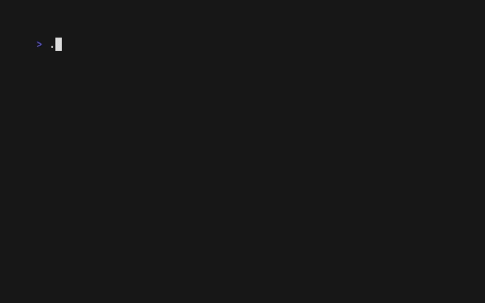
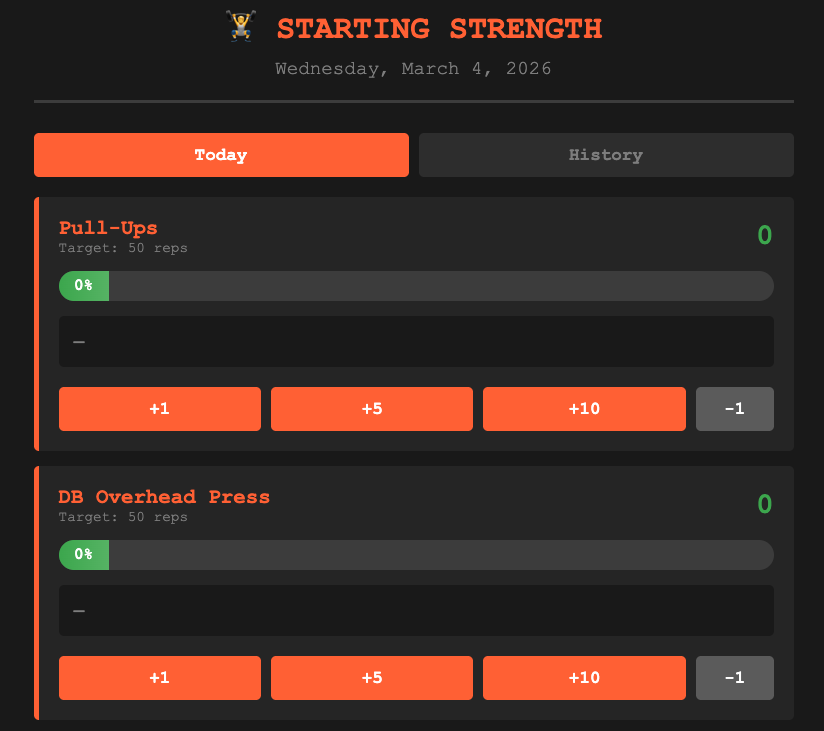
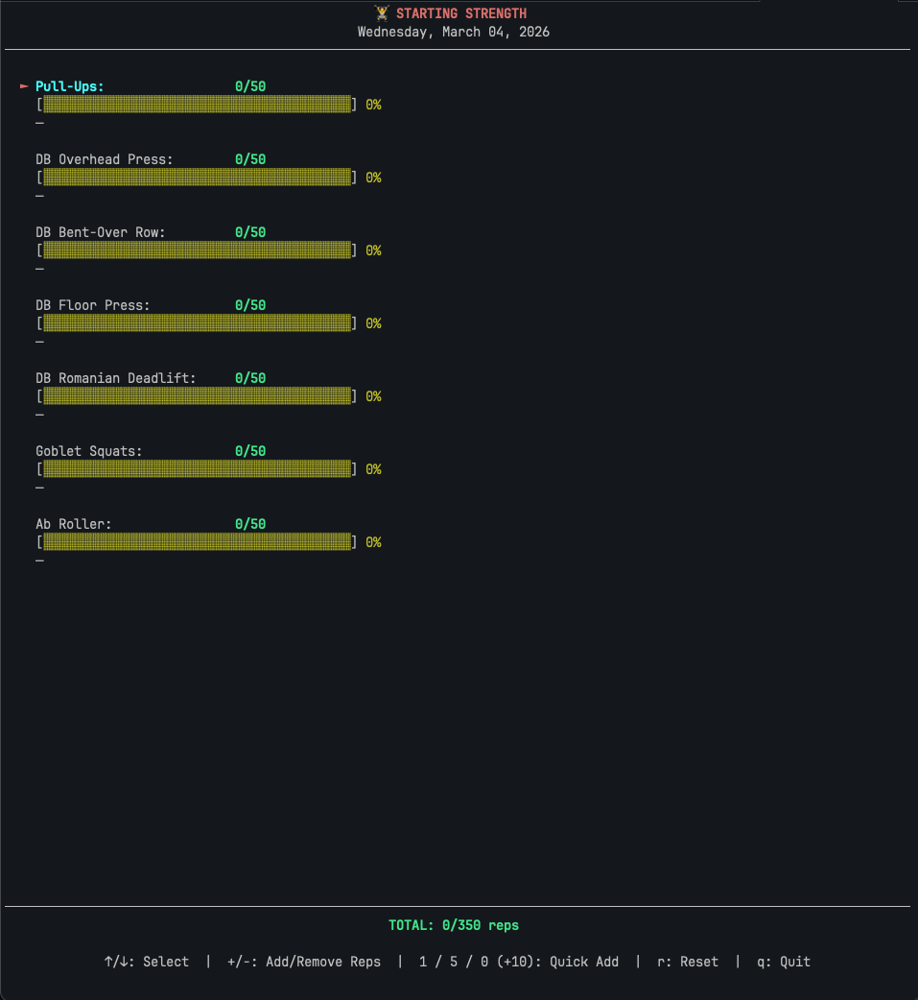

# repcli

No GUI, no excuses



## Run

```bash
go build -o repcli .
./repcli
```

## Controls

- `j/k` or arrows — navigate
- `enter` — select / next exercise
- `s` — skip block
- `m` — back to menu
- `q` — quit

## Customize Workouts

Edit `workouts.yaml`. Format:

```yaml
Workout Name:
  Block Name (duration):
    - Exercise name | sets | tempo | notes
```

Tempo and notes are optional. Examples:

```yaml
Upper Body:
  Warmup (5 min):
    - Arm circles | 30 sec each direction
    - Push-ups | 2 x 10

  Main (15 min):
    - Bench Press | 3 x 10 | 3s down, 1s up | Go heavy
    - Rows | 3 x 12
```

## Generate Your Own

Ask an AI to create a `workouts.yaml` for you. Example prompt:

> Create a workouts.yaml file for repcli. Here's my situation:
>
> - 42 year old male
> - Haven't exercised since the series finale of Lost (2010)
> - Equipment: two dusty dumbbells, a pull-up bar I've used as a towel rack, and a yoga mat the dog sleeps on
> - Goals: be able to chase my kids without wheezing, maybe see a muscle one day
> - Time: 20 min max before I lose interest or get a work Slack
> - Injuries: my ego, also a "bad knee" that's never been diagnosed but I mention constantly
>
> Keep it simple. I will quit if it's too hard.
>
> Format:
> ```yaml
> Workout Name:
>   Block Name (duration):
>     - Exercise | sets | tempo (optional) | notes (optional)
> ```

## Secondary Tools

Standalone trackers based on the [Starting Strength](https://startingstrength.com) dumbbell program.
Each tracks 7 exercises toward a daily 350-rep goal.

### Web (browser, no install)
Open `tools/starting-strength/starting-strength.html` in any browser.
Progress saves to `localStorage`.

<!-- screenshot: open the HTML file, take a screenshot showing the tracker with a couple exercises in progress -->


### Terminal (Python 3, no dependencies)
```bash
python3 tools/starting-strength/starting_strength.py
```
Navigate with arrows, add reps with `+`/`-` or `1`/`5`/`0`.

<!-- screenshot: run the python script, take a terminal screenshot with iTerm or similar -->


---

Built with [Claude Code](https://claude.ai/code)
